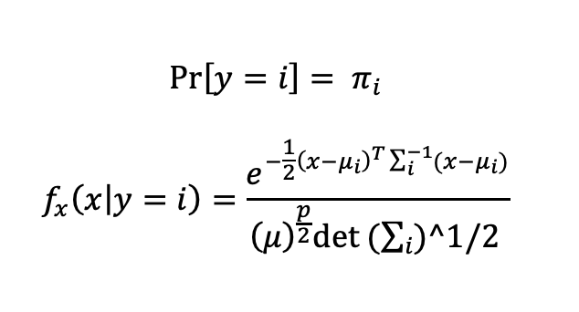
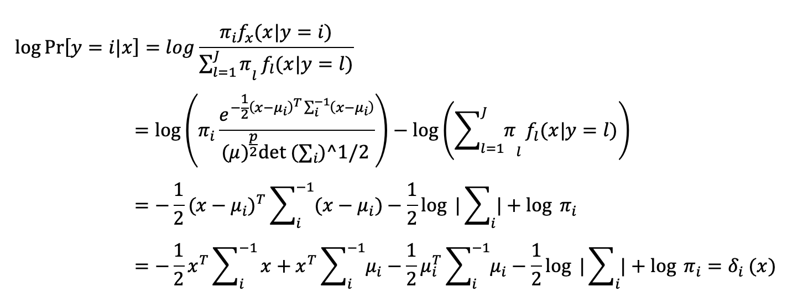
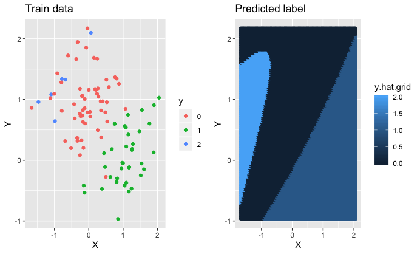
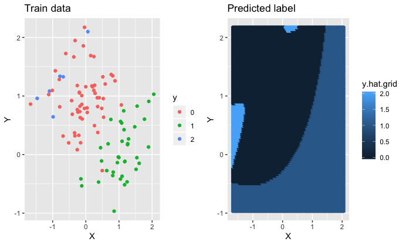
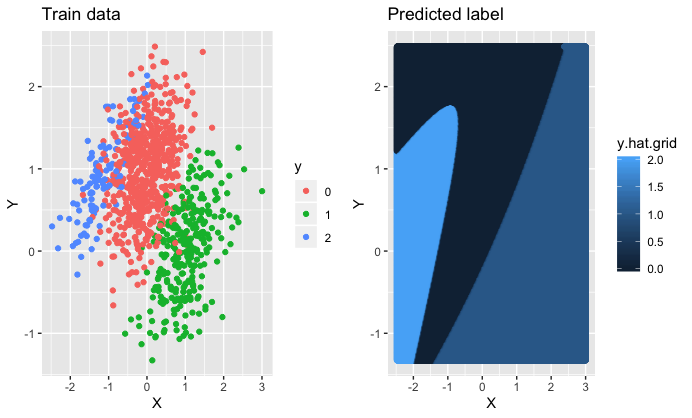
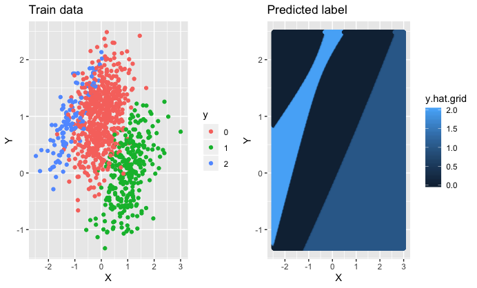

## Naive Bayes Classifier & Quadratic Discriminant Analysis
Bayes classifier is an alternative method to logistic regression which tries to model P[Y=i|X=x] less directly. The R script provides two models: Naïve Bayes which is using population parameters, and Quadratic Discriminant (QDA) which is based on population statistics and assumes, for each class, different covariance matrix.

### Setup
Data generating process:
&nbsp;

&nbsp;

Calculating discriminant function δi(x) defined as log P[y = i|x]:
&nbsp;

&nbsp;

### Comparison
Bayes Classifier n=100
&nbsp;

&nbsp;

QDA n=100
&nbsp;

&nbsp;

Since Optimal Bayes (plot above) is using parameters from the population, it is immune from noise and variance occurring in the sample. This results in better performance over the test data regardless of the sample we have which in consequence ends with lower error rate. On the other hand, QDA is using estimates of population; thus, it is very dependable on the sample. It needs to estimate Jp(p+1)/2 parameters in total, thus every variance in the sample will have an impact on it. In addition, we see that QDA tends to overfit to accommodate the sample. This will cause problems with proper prediction of classes over the test data.

Bayes Classifier n=1000
&nbsp;

&nbsp;

QDA n=1000
&nbsp;

&nbsp;

The increased sample size proves our point from the above. Again, we see that the space partition is very similar between Optimal Bayes Classifier whether we are using n=100 or n=1000. On the other hand, QDA space partition drastically differ from the smaller sample. The increased size has a positive effect on QDA because it will now better predict observations class over new data. Similarly to the smaller sample, QDA tends to overfit.

Unlike Bayes Classifier, QDA is at the mercy of the sample. If we are having a numerous sample with good representation of the population QDA should perform well on the test data and space partition should be similar to the Optimal Bayes Classifier. If otherwise, we will have a higher error rate.
